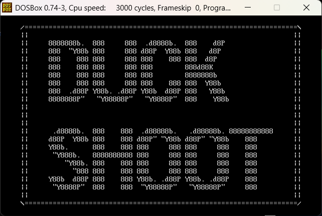
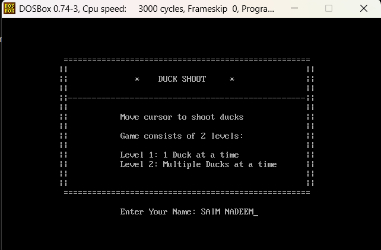
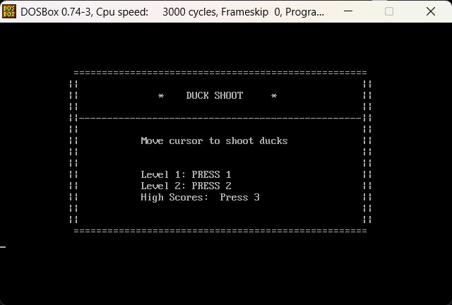
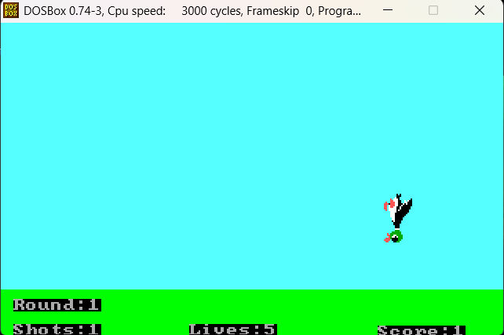
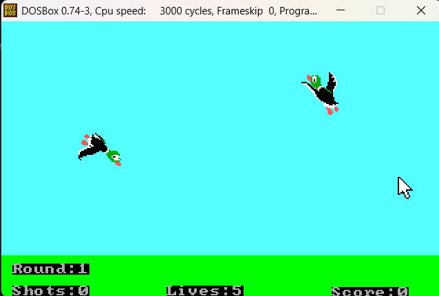

# Duck Shoot Arcade Game

## Overview
Duck Shoot is an arcade-style shooting game developed entirely in x86 Assembly Language using MASM615.  
Players aim to shoot animated ducks flying across the screen to earn points. The game features multiple rounds, increasing difficulty, score tracking, player name input, and a high score system.

---

## Preview

### Home Screen / Logo


---

## Features

- Splash, Welcome, and Menu Screens  
- Player Name Input  
- Single & Multi-Duck Game Modes  
- Random Duck Movement with Speed Variation  
- Timer and Scoreboard  
- Lives and Bullets Indicator  
- Multi-Round Progression  
- Game Over Screen  
- File Handling for Saving Player Names and High Scores  
- High Score Table (Persistent Between Runs)

---

## Game Modes

### Mode 1: Single Duck
- Three progressive rounds  
- One duck on screen at a time  
- Increasing difficulty and speed  
- Score updates after each hit  

### Mode 2: Multi-Duck
- Multiple ducks on screen simultaneously  
- Limited bullets  
- Faster duck movement  
- Game ends when time or bullets run out  

---

## Screens & Navigation

### Enter Name


### Game Menu


### Gameplay - Level 1


### Gameplay - Level 2


---

## File Handling

- Saves each player's name and score in `scores.txt`  
- Only the **highest score** per player is retained  
- Scoreboard loads from and updates to file at runtime  

---

## How to Run

1. Open the project in MASM615  
2. Assemble and link `DuckShoot.asm`  
3. Run the executable  
4. Enter your name and choose a game mode  
5. Use the cursor to aim and shoot ducks  
6. Advance through rounds and try to beat the high score  

---

## Project Structure
```
DuckShoot/
├── DuckShoot.asm ; Main Assembly source file
├── images/ ; Game screenshots and visuals
│ ├── img1.png ; Home screen / logo
│ ├── img2.png ; Enter name screen
│ ├── img3.png ; Menu screen
│ ├── img4.png ; Gameplay - Level 1
│ └── img5.png ; Gameplay - Level 2
├── scores.txt ; Player names and high scores (created at runtime)
└── README.md ; Project documentation
```

---

## Reference Game

- [Google Play - Duck Shoot](https://play.google.com/store/apps/details?id=com.tingtingstudio.duckshoot)  
- [Gameplay Example (YouTube)](https://www.youtube.com/watch?v=J3sfsP9W048)  

---

## Author

**SAIM Nadeem** [Saim Nadeem](https://github.com/Saim-Nadeem)bute.

---

## License

This project is licensed under the [MIT License](LICENSE).  
You are free to use, modify, and distribute this project with attribution.

---

## Contributing

Contributions are welcome!  
If you'd like to suggest improvements, report bugs, or add features:

1. Fork this repository  
2. Create a new branch (`git checkout -b feature-name`)  
3. Commit your changes (`git commit -am 'Add new feature'`)  
4. Push to the branch (`git push origin feature-name`)  
5. Open a Pull Request

For questions or feedback, feel free to open an issue.
